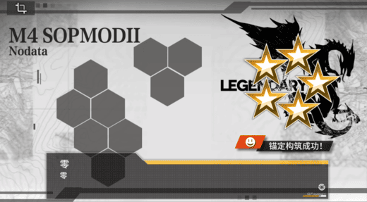

# 逆向 02 跳过结算动画

[toc]

&emsp;&emsp;本篇文章将从**Unity UI 劫持**的角度来讨论如何跳过某些游戏动画。我们从最外层的网络抓包，一路寻找到内部的动画调用。穿透业务逻辑、`xLua`桥接层、多线程限制、汇编指令，最终直达`Unity`引擎的`C++`底层。

## 一、基础问题

&emsp;&emsp;首先我们通过Frida-Tools完成了一个基本的`Gizp->Json->AuthKey->Session`中的`json`解包功能。并提取出了如下的

```json
// ...
    "mission_win_result": {
        // ...
        "user_exp": "88",
        "reward_gun": [
            {
                "gun_with_user_id": "530081393",
                "gun_id": "107"
            }
        ],
        // ...
    },
// ...
```

其中，我们只需要关注`reward_gun`，即我们获得的T-Dolls。这里我们需要引入的问题是：**我们能否跳过T-Dolls的结算动画？**

## 二、移除字段

&emsp;&emsp;一种最简单的尝试是我们直接移除`reward_gun`这一个字段。那么然后将`Json`压缩回`Gzip`，将其传递给游戏。

- **优点**：从上述的字段中我们不难发现，游戏本地没有保存任何有关T-Dolls的数据，全部存放在服务器的数据库中。因此，通过**移除字段**的方式，我们实现了：
    1. 游戏本地没有任何T-Doll的数据；
    2. 在服务器端我们成功结算了任务，获取到了T-Doll的奖励。
- **缺点**：在我们编写的MaaPipeline中，包含了T-Doll拆解的流程。但是当我们采取上述方式来跳过结算动画时，我们发现：
    1. 本地的仓库永远不会增加(这是在意料之中的)；
    2. 服务器端会在部署任务过程中进行二次校验，即——正常情况下服务器会提示本地客户端执行**拆解MessageBox**；但是我们得到的结果确是**踢下线MessageBox**。
    
服务器通过**重新登陆**的方式，来强制同步远程与本地的数据。虽然我们实现了跳过结算动画，优化了部分的时间，但是频繁上下线所带来的额外开销不是我们期望的。

## 三、从Unity角度思考

### 3.1 The Controller Hunt

&emsp;&emsp;最初，我们试图寻找结算界面，通过`script.json`找到了`BattleResultController`。但是我们这个游戏它的UI是队列化的、分散式的，例如：上述`json`中的`user_exp`和`reward_gun`不在同一个控制器中。

&emsp;&emsp;接着，由于在`script.json`的上百万行代码中找一个函数是不现实的，我们转而使用Taint Analysis的思路。因为我们要找的是“展示获得T-Dolls(Gun)”的界面，那么这个界面的初始化函数必定会接收“Gun”作为参数。我们通过Python脚本遍历`script.json`，寻找参数签名中包含`GF_Battle_Gun_o*`，且类名包含`Controller/UI`的方法。

&emsp;&emsp;最终，我们找到了`CommonGetNewGunController`。

### 3.2 The Execution Pitfalls

&emsp;&emsp;找到目标后，我们试图在Frida中延迟调用它的`Close()`方法，引发了连环事故：

1. `0x10`空指针崩溃：
    - 原因：Unity是严格的单线程渲染引擎。Frida的`setTimeout`运行在独立的JS线程中，试图从外部线程调用Unity原生UI函数，无法获取TLS(线程局部存储)，直接崩溃。
    - 修改：改用Hook引擎每一帧都会调用的`Update`方法，在主线程中完成修改。
2. Frida注入失败`unable to intercept function`：
    - 原因：我们试图Hook返回布尔值的判定函数`CanShowUI`。但在`x64`汇编中，这种函数只有极短的3字节`xor eax,eax; ret`，而Frida的跳板跳转指令(Trampoline)需要至少5-14字节，强行注入会破坏内存。
    - 修改：放弃高级API，使用`Memory.protect`解除写保护，直接将机器码覆写进内存(Direct Memory Patching)。

### 3.3 The Placeholder

&emsp;&emsp;当我们利用内存补丁阻断了UI，并尝试伪造信号跳过时，屏幕上出现了经典的“M4 SOPMODII Nodata”占位符。如下图所示：



这是因为，该UI预制体实际上是由底层的xLua直接`Instantiate`生成的，然后才把控制权交回给C#(调用`InitGunInfo`)。因为我们拦截了`InitGunInfo`且伪造了完成信号，UI内部状态机未初始化完成。此时调用游戏原生的`Close()`会被其内部的安全检查拒绝(没有初始化，不能关闭)，导致占位符出现在屏幕上。

&emsp;&emsp;既然我们的游戏没有完成上述的GC工作，那么我们则直接尝试调用Unity的引擎来完成资源回收。

1. 我们在`script.json`中搜索了Unity的API——`UnityEngine.Component$$get_gameObject`和`UnityEngine.Object$$Destroy`。
2. 当Lua把Nodata空壳塞进屏幕，并调用`InitGunInfo`时，我们瞬间拦截。
3. 解析IL2CPP Delegate的底层结构(偏移量`0x18`是函数体，`0x20`是目标)，直接提取出Lua传过来的`Action`回调指针并`Invoke`触发。Lua以为玩家看完了动画，于是继续执行下一步。
4. 我们拿着被拦截的`__this`(组件指针)，调用引擎的`get_gameObject`获取物理实体，立刻`SetActive(0)`防止闪烁，最后塞给引擎的`Destroy()`。

最终，我们的结算动画在出现的第0帧即被"kill"。

## 四、总结

&emsp;&emsp;`script.json`不仅仅是一本“字典”，结合Python编写简单的启发式脚本(基于参数类型、基于类名后缀)，可以让在几百万行代码中瞬间捞出目标，这比传统的IDA静态分析快无数倍。

&emsp;&emsp;在**Unity C#**中，回调函数极多。掌握从内存偏移量(`0x18`和`0x20`)提取指针并使用NativeFunction强行执行的技术，是Control Flow Hijacking的常用手段。

&emsp;&emsp;在处理UI跳过时，最好的办法不是阻止它生成(容易卡死队列)，而是让它生成，但在它被GPU渲染出第一帧之前，拿到`GameObject`并`Destroy`它。

&emsp;&emsp;当游戏(业务)的`Close/Hide`函数不生效时，永远记得去找`UnityEngine.Object$$Destroy`或`SetActive`。