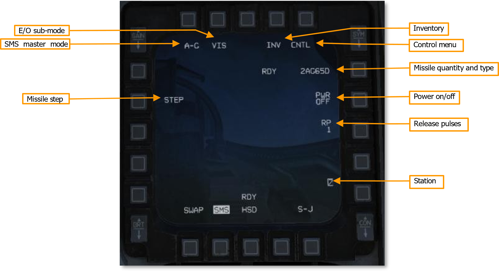
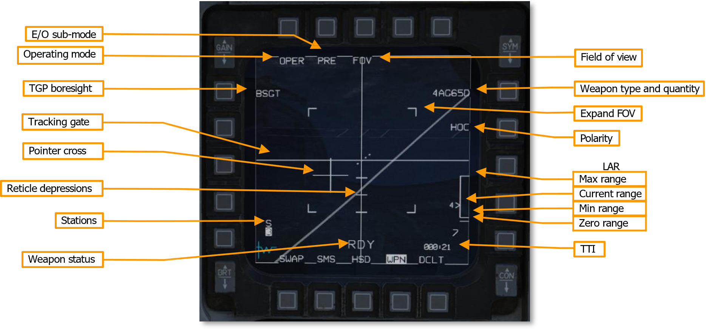

# Air-to-Ground Weapons Employment

[toc]

## 1. AGM-65 小牛

在`1.1`到`1.3`中，我们将介绍F-16C和小牛的基本参数、页面等内容。在身下的`1.4`小节中开始介绍如何使用小牛。

### 1.1 型号

1. **AGM-65D Maverick**
    - 红外成像
    - 制导系统
    - **125磅**定形装药弹头
2. **AGM-65G Maverick**
    - 同`D`
    - **300磅**定形装药弹头
3. **AGM-65H Maverick**
    - CCD成像（仅白天可用）
    - 和`D`型号的Centroid Tracking不同，`H`采用Forced Correlation进行锁定，有更高的识别度
    - **125磅**定形装药弹头
4. **AGM-65K Maverick**
    - 同`H`
    - **300磅**定形装药弹头

### 1.2 简介

**AGM-65**系列导弹需要预热才能使用，预热期间可以在`WPN MFD`处于`SOI`状态下按下**Uncage**按钮，当陀螺仪达到$90\%$转速时，导弹视频画面将同步到`WPN MFD`。

飞行员可以使用机载火控雷达（Fire Control Radar, FCR）、抬头显示器（Head-Up Display, HUD）、AGM-65自身锁定目标，也可以使用吊舱（Targeting Pod, TGP）来进行标准。当接收来自TGP的目标时，导弹瞄准线相关器（Missile Boresight Correlator, MBC）会将瞄准吊舱的图像与导弹导引头的图像进行比较，并调整导弹导引头的指向，直到两幅图像匹配为止。

### 1.3 页面介绍

#### 1.3.1 A-G `SMS` Page

切换到**A-G**模式后，SMS页面如下。



1. **SMS master mode**
    - 切换`A-G`和`STRF（gun strafe）`模式
2. **E/O sub-mode**
    - 轮换`PRE`、`VIS`或者`BORE`子模式
        * `pre-planned`，允许锁定Sensor Point of Interest （SPI）附近的目标。`PRE`使用`CCRP`风格的图标，同时将导引头和SPI同步；
        * `visual`，通过HUD上的目标指示器（TD）锁定正前方的目标；如果导弹装载在LAU-88/A挂架上，则`VIS`模式不可用；
        * `boresight`，旨在用于快速反应或机会目标攻击。在`BORE`模式下，导弹可以发射攻击任何目标，而无需更改SPI。导引头与HUD上的十字指示器同步。
    - 该功能同样可以通过油门把手上的`RDR CURSOR/ENABLE`进行切换
3. **INV**
    - 按下显示Inventory page
4. **CNTL**
    - 按下显示Control page
5. **Missile quantity and type**
    - 轮换不同类型的`AGM-65s`
6. **Power on/of** （Auto power toggle）
    - 开启或关闭自动电源
7. **RP** （Release pulses）
    - 控制每次发射的导弹数量，仅适用于`AGM-65D`和`AGM-65G`
8. **Stations**
    - 显示`AGM-65s`的挂载点，下一个发射的挂载点用高亮表示
9. **STEP** （Missile step）
    - 轮换不同的挂载点

#### 1.3.2 A-G `SMS CNTL` Page

1. **Auto power toggle**
    - 开启或关闭自动电源
2. **Auto power steerpoint**
    - 设置小牛自动开启的转向点
3. **Auto power direction**
    - 设置飞机飞过上述转向点的大致方向，以便于自动上电小牛。

#### 1.3.3 `WPN` Page



##### MFD相关

1. **Operating mode**
    - 轮换`STBY（standby）`和`OPER（operating）`模式
2. **E/O sub-mode**
    - 轮换`PRE`、`VIS`或者`BORE`子模式，与`SMS MFD`相同
3. **FOV** （Field of view）
    - 切换宽窄视野
    - 当武器模式为`SOI`时，也可以使用HOTAS的`Expand/FOV`切换
    - 无论什么模式，都可以使用HOTAS的`MANRNG/UNCAGE`切换
4. **BSGT** （TGP boresight）
    - 当小牛的导引头和吊舱指向同一个目标时，按下此按钮，将当前的小牛导弹挂架与瞄准吊舱（TGP）进行同轴校准
        * 为什么：由于瞄准吊舱（TGP）和小牛的导引头（Seeker）隶属于两个不同的传感器，因此需要进行类似图像算法的“registration”的标定程序。
        * 如何校准：在地面上或空中，先用（TGP）锁住一个目标，比如一辆坦克，然后手动控制小牛导引头也锁住这辆坦克。此时两个传感器对准了同一点，按下这个按钮`BSGT`，系统就会记住这个相对位置误差。
        * 效果：TGP看向哪里，小牛导引头就会自动同步看向哪里。
    - 这里是按照挂架（Station）进行校准，即不同的挂架进行不同的校准，而不需要对三联挂架上的每一枚导弹单独进行校准
5. **Weapon type and quantity**
    - 轮换不同的类型的`AGM-65s`，与`SMS MFD`相同，显示当前的`数量类型`
6. **Polarity**
    - 切换`hot-on-cold（HOC）`和`cold-on-hot（COH）`，也可以按HOTAS的`TMS Right`切换
    - `-H`型号额外拥有`AREA`模式
7. **Weapon status**
    - `REL`：发射信号已经传输给武器
    - `RDY`：武器解锁（armed）并且等待发射
    - `MAL`：武器因为故障（malfunction）无法发射
    - `SIM`：武器未解锁（unarmed）不会正常发射，界面的所有瞄准和发射指示照常显示，供训练使用

##### 导弹相关

1. **Tracking gate** （贯穿屏幕的十字）
    - 指示导弹跟踪的目标
2. **Pointer cross** （屏幕中的小十字）
    - 相对于屏幕中心的导引头方向，导引头范围是：水平${\pm}{42}^{\circ}$，垂直${+}{30}^{\circ}{-}{54}^{\circ}$
    - 当不满足如下任意条件时，十字闪烁：
        * 导引头必须在boresight的${\pm}{10}^{\circ}$以内
        * 图像目标必须足够大以便于跟踪
3. **Reticle depressions** （分划）
    - 每${5}^{\circ}$一个横线分划
4. **Expand FOV**
    - 缩放的视野范围
5. **LAR**
    - 导弹的发射范围
6. **Stations**
    - 显示`AGM-65s`的挂载点，下一个发射的挂载点用高亮表示，同`SMS MFD`
    - 数字上方新增了一个用于表示Missile Boresight Correlator （MBC）状态的字符
        * `S`：**Slave**，被动模式。导弹跟随飞机的预设视线或TGP大致方向，导弹没有主动寻找或对其目标；
        * `1`：**Slew 1**，视线对其。当按下传递/锁定键时，MBC开始介入，计算出TGP此时朝哪看（TGP LOS），然后控制导弹挂架和导引头内的电机，把导弹的视线（Missile LOS）快速转过去，让两者朝向同一个空间坐标。
        * `2`：**Slew 2**，视频图像对比。MBC正在计算导弹和TGP的Correlation，让两幅画面进行对齐。类似于图像算法的registration。
        * `T`：**Track**，导弹尝试锁定。MBC将计算结果后命令导弹锁定目标。
        * `C`：**Complete**，目标传递完成。成功锁定目标，可以发射。
        * `I`：**Impossible**，无法完成。由于天气、校准误差等原因，MBC在`1`或`2`中的某个步骤出现了问题。此时通常将MFD切换到小牛手动锁定，或者重新控制吊舱。
7. **TTI** （Time to impact）
    - 如果现在发射，多久后击中目标。

### 1.4 准备

小牛开机后的生命周期如下：

| 状态 | 耗时/可用时间 | 发生了什么 |
| --- | --- | --- |
| **1. 预热 (Warm-up)** | **3 分钟** | 导弹刚通电。如果是红外型（D/G），此时液氮冷却系统开始给导引头急速降温；如果是可见光型（H/K），陀螺仪开始高速旋转稳定，电路进行自检。此时导弹不可用。 |
| **2. 待机 (Standby)** | **1 小时** | 预热完成。随时准备接收火控数据，但**它的视频画面还没有传到座舱屏幕上**（属于后台挂机状态）。这个状态最多只能维持1小时。 |
| **3. 激活 (Active)** | **30 分钟** | 切换小牛的`WPN MFD`，**导引头开始实时传输视频（Video）**。此时导弹内的成像芯片全功率运转，光学跟踪电机疯狂工作。这个状态最多只能维持30分钟。 |

由于制冷机和陀螺仪的寿命限制，因此我们不应该在起飞后就为小牛上电，而是参考：

1. 起飞/巡航时：保持小牛处于`OFF`状态；
2. 距离战区/弹着点还有5到10分钟航程时：为小牛上电，让它开始预热；
3. 进入战区后：进入`Standby/Active`状态，在30分钟内将导弹打出。

#### 1.4.1 自动上电

`SMS MFD`可以配置小牛的自动上电功能，这使得驾驶员无需记住在交战前手动上电。*`OSB`按钮按照从左上方开始顺时针旋转序号*。

1. 在`SMS MFD`，按下`OSB 6`，直到切换到小牛`*AG65*`；
2. 在`SMS MFD`，按`CNTL (OSB 5)`按钮切换到控制页面（此时`CNTL`字符高亮）；
3. 在`CNTL MFD`，按`STPT x (OSB 19)`切换航路点，小牛导航仪在经过该航路点时自动上电：
    - 按下`OSB 19`后弹出页面；
    - 使用`OSB x`面板输入航路点`x`；
    - 同时，MFD上会新出现如下的三个按钮
        * `ENTER`，保存航路点（类似于回车）；
        * `RTN`，返回`CNTL`不保存（类似ESC）；
        * `RCL`，撤销数字（类似退格）。
4. 在`CNTL MFD`，完成上述航路点选择后，现在选择方向，并且启用自动上电：
    - 按下`OSB 20`切换不同航向，小牛在**飞跃设定的航向点后**并且按着这个**大概的方向**飞行后才会启动；
    - 按下`OSB 7`将`AUTO PWR`切换到`ON`，以启用自动上电。
5. 现在我们已经启用了“自动上电”功能，可以再次按`CNTL (OSB 5)`离开控制页面。

#### 1.4.2 同轴校准 (Missile Boresighting)

这里就是上述内容提到的校准，这部分可以在空中也可以在地面进行。

##### 1. 为小牛和吊舱上电

1. 将`TGP`和`SMS`分别放到两个MFD上；
2. 如果小牛没有上电，可以在`SMS`中按下`OSB 6`切换到小牛，再按`OSB 7`将`PWR OFF`切换到`PWR ON`以实现手动上电；
3. 如果TGP没有上电，将`Right Console` $\rightarrow$ `SNSR PWR Control Panel` $\rightarrow$ `RIGHT HDPT Switch`推到`ON`。

##### 2. 解除保险

1. 如果在地面上：
    - 将`Left Auxiliary Console` $\rightarrow$ `Landing Gear Panel` $\rightarrow$ `GND JETT ENABLE`设置到`ON`；注意这里是起落架附近的`GND JETT ENABLE`，而不是`Landing Gear Panel`位置的`JETT`，后者是干扰弹相关的。这里是“允许在地面紧急抛弃武器/副油箱”，允许在地面接通外挂物的控制总线。
    - 在ICP面板中按下`A-G`按钮，切换到空对地模式；
    - 将`MASTER ARM`切换到`SIM`挡位
2. 如果TGP不处于空对地模式：
    - 在MFD的`TGP MFD`，按下`STBY`的OSB按钮，然后按下`A-G`的按钮，让吊舱进入A/G模式。

##### 3. 小牛的子模式

1. 在`SMS MFD`，按下`OSB 2`将小牛切换到`PRE`或者`VIS`子模式（或者HOTAS上的`RDR CURSOR/ENABLE`来实现）；
2. 将`SMS`切换到`WPN MFD`，确认`NOT TIMED OUT`不再显示，小牛预热结束，开始显示引导头的画面。

关于`PRE`、`VIS`和`BORE`的简要说明：

1. `Pre-planned`
    - 火控源：导航计算机（GPS/INS坐标）
    - 数据流：坐标点 $\rightarrow$ TGP & 小牛
    - 适用场景：固定坐标的雷达、基地等
2. `Visual`
    - 火控源：HUD（LOS角度）
    - 数据流：HUD $\rightarrow$ TGP & 小牛
    - 适用场景：无固定坐标的视界内打击，例如移动车队
3. `Boresight`
    - 火控源：无/导弹自身
    - 数据流：机头方向 $\rightarrow$ 小牛
    - 适用场景：快速打击

需要注意的是，这里的`Boresight`指的是小牛自己的模式；而这里的“Boresighting”指的是吊舱和小牛直接的配准。同时，对于`VIS`模式下将吊舱进入地面跟踪，有如下值得额外了解的内容：

1. 纯`VIS`状态：
    - 数学表达：此时系统只知道一组角度（$\theta, \phi$），即一根从飞机机头出发、射向无限远处的三维向量（LOS Vector）。
    - 特性：光标属于HUD坐标系。飞机一晃，这根射线在三维空间中就跟着晃（未固联于地面）。
2. TGP介入
    - TGP利用自身的激光测距仪（Laser Ranger）或者雷达测高（Radar Altitude）/ 数字地球模型（DTED），去计算这根射线与地表交点的距离（Distance $R$）。
    - 此时，系统拥有了：飞机当前 GPS 坐标 + 视线矢量（方向） + 距离（$R$）。
3. 地面跟踪
    - 当按下操纵杆上的`TMS Up`键，让TGP进入地面跟踪（AREA/POINT）时，火控计算机通过上述数据，反推出了那个地表目标的绝对地理三维坐标（纬度、经度、高程）；
    - 火控计算机在内存里创建了一个临时目标点（Dynamic System Target）。同时现在的SPI不再是HUD上的视线角度，而是刚刚算出来的这个 $X, Y, Z$ 地面坐标；
    - 此时导引头和TGP不再跟随HUD，而是转入和`PRE`类似的固定坐标模式。

于是`VIS`和`PRE`的区别体现在两个方向：

1. 收敛：如果从`VIS`收敛到地面跟踪的时候，飞机正在高速机动，那么可能导致临时坐标出现漂移误差；
2. 回退：如果TGP丢失跟踪之后，`PRE`模式下将返回原有的航路点；而`VIS`模式将返回到HUD上，会造成对原先SPI的丢失。

##### 4. 吊舱对齐

1. 通过`DMS Aft-Short`（DMS向下键）将`SOI (Sensor of Interest)`（白色边框）移动到MFD上的`TGP MFD`；
2. 使用`RDR CURSOR/ENABLE switch (RDR CURSOR)`将TGP十字指向目标。

##### 5. 小牛对齐

1. 通过`DMS Aft-Short`（DMS向下键）将`SOI (Sensor of Interest)`（白色边框）移动到MFD上的`WPN MFD`；
2. 使用`RDR CURSOR/ENABLE switch (RDR CURSOR)`将小牛的`tracking gate`指向目标，然后按`TMS Forward`指定目标；
3. 检查`tracking gate`是否闭合，并且正在跟踪我们指定的目标。

##### 6. 确认对齐

1. 按下`BSGT (OSB 20)`以实现校准；
2. 按下`TMS Aft`（TMS向下键）结束小牛的跟踪，然后通过移动TGP吊舱的视角，确认配准已经成功。

##### 7. 重复

对每个挂架（Station）的小牛都重复上述(4)到(6)的步骤。

##### 8. 下电

1. 完成校准后，返回`SMS MFD`，将`PWR ON`切换到`PWR OFF`完成下电；
2. 复位`MASTER ARM (OFF)`、`GND JETT ENABLE`；ICP面板点击`A-G`，从空对地模式切换回master模式。

### 1.5 发射

这里我们遵循DCS的F-16C说明书内容进行讲解，其中吊舱的“handoff”（吊舱锁定）将在`1.5.4`中介绍，前面的`PRE`、`VIS`和`BORE`模式都是直接使用小牛/机载火控雷达进行锁定目标。

#### 1.5.1 PRE模式

1. 在`WPN MFD`，使用`OSB 2`或者`RDR CURSOR/ENABLE switch`将子模式切换到`PRE`；
2. 按下`DMS Aft-Short`切换SOI到`WPN MFD`；
3. 使用`RDR CURSOR/ENABLE switch`将`tracking gate`对准目标，然后按`TMS Forward`进行指定；
4. 确认导弹正在跟踪目标、`pointer cross`不闪烁、目标在射程内（LAR）；
5. 按下`Weapon Release button`发射导弹。

#### 1.5.2 VIS模式

1. 在`WPN MFD`，使用`OSB 2`或者`RDR CURSOR/ENABLE switch`将子模式切换到`VIS`；
2. 此时SOI移动到HUD上；
3. 使用`RDR CURSOR/ENABLE switch`移动HUD上的TD Box，按下`TMS Forward`让TD Box进入“ground-stabilize”，并且SOI将切换到`WPN MFD`；如有必要，也可以通过`DMS Forward`将HUD设置为SOI然后使用`DMS Aft-Short`取消“ground-stabilize”模式；
4. 如有必要，可以使用`OSB 7`更换导弹的极性（热成像模式）；
5. 使用`RDR CURSOR/ENABLE switch`将`tracking gate`对准目标，然后按`TMS Forward`进行指定；
6. 确认导弹正在跟踪目标、`pointer cross`不闪烁、目标在射程内（LAR）；
7. 按下`Weapon Release button`发射导弹。

#### 1.5.3 BORE模式

1. 在`WPN MFD`，使用`OSB 2`或者`RDR CURSOR/ENABLE switch`将子模式切换到`BORE`；
2. 按下`DMS Aft-Short`切换SOI到`WPN MFD`；
3. 导弹导引头位置将在HUD上显示为十字形，导引头位置初始为瞄准线；
4. 其余瞄准同`VIS`。

#### 1.5.4 TGP handoff

1. `DMS Aft`将SOI切到TGP页面；
2. 通过`RDR CURSOR/ENABLE switch`寻找目标，同上述几种直接使用导引头的模式；
3. `TMS Forward`锁定目标；
4. SOI自动跳转到`WPN`完成锁定，如果WPN导引头显示：`S` $\rightarrow$ `1` $\rightarrow$ `2` $\rightarrow$ `T` $\rightarrow$ `C` 的状态机跳变，那么表示锁定成功；
5. 发射。

这里需要注意的是：

1. 如果TGP将和吊舱没有严格配准（例如我们在地面标定可能不够准确），在长距离上由于TGP和导引头没有严格对准同一个点，因此无法准确传输数据，此时在(4)中虽然SOI跳变到`WPN`，但是没有出现“正在传输数据”这样的字符，导致锁定失败；
2. 此时可以使用小牛手动微调锁定。

关于进阶的吊舱使用，将在下面的章节讲述。

## 2. AN/AAQ-33 | AAQ-28

由于DCS更新历史原因，先推出了AAQ-28再推出了AAQ-33，因此这里参考F-16C的说明书将AAQ-33作为教程，两者在使用上并无太大区别。AAQ-33包含了如下的传感器：

1. CCD TV Camera
    - 单一视场角可见光镜头
2. FLIR Thermographic Camera
    - 双视场角红外镜头（两个视场角均大于可见光）
3. Dual-Mode Laser Designator/Ranger
    - 有源 (Active) 发射接收一体的激光系统，用于精准测距、引导激光武器
4. Laser Spot Tracker
    - 被动 (Passive) 激光接收器，用于对地面、友机的激光指示目标提供空中支援
5. Infrared (IR) Pointer
    - 适用于夜视仪的激光发射器
6. Video Datalink (VDL) **DCS暂未实现**
    - 将吊舱的图像画面传递给地面单位

缩放相关如下：

1. Variable Zoom
    - 连续可调变焦，允许将FLIR和CCD传感器视频放大$1$倍至$4$倍。只缩小视场角，以便于查找更远的目标，并不提高传感器本身的分辨率。
2. Extended Range (XR) Zoom
    - 算法补偿变焦，固定$3$倍放大，通过图像增强对分辨率进行补偿，并且需要等待算法的适应时间。
3. Picture-In-Picture (PIP)
    - 画中画，将TV视频叠加到FLIR上（中心对齐），以便于更准确地查找目标。

### 2.1 Slave, Slew, and Tracking Controls

在下文中，我们使用TGP来代指AAQ-33。TGP与HOTAS相关，主要使用右手操纵杆（SSC）上的**目标管理开关（TMS）**和**扩展/视场（EXP/FOV）**来控制，同时使用油门把手上的**雷达光标（RDR CURSOR/ENABLE switch）**来操作吊舱转向。

当主控电脑（MMC）控制SPI时（例如默认跟踪航路点），飞机的各个传感器将保持“从动、隶属（Slaved）”于该SPI。如果TGP处于从动模式（Slave Mode，在`TGP` MFD界面上表现为巨大的视线十字准星），TGP传感器的视线就会死死绑定在SPI的三维地理位置上。如果SPI移动，TGP 的视线会自动转过去以保持对齐。此逻辑的唯一特例是开启了激光点跟踪（LST）模式，此时TGP会从SPI上“解耦”出来，去自主搜寻外部的激光指示信号。

如果当TGP在A-G模式下进入了跟踪模式（Tracking state），例如按下`TMS Forward`锁定了一辆坦克，TGP将自身接管并决定SPI的位置。此时，如果空地雷达（`FCR MFD`）正处于地面测绘（GM/GMT/SEA）模式且之前锁定了一个地面目标，雷达将自动断开它原本的跟踪，并且雷达的捕捉光标会自动变成“从动”状态，转过去对准TGP控制的这个新SPI。同时，如果之前在`HAD MFD`上指定了由HTS干扰吊舱检测到的雷达威胁目标，该指定也会被自动自动丢弃。相应的，如果雷达（FCR）进入了跟踪状态，或者在`HAD MFD`上指定了雷达威胁，TGP也会自动断开它当前的图像跟踪，并变成“从动”状态，转过去跟随雷达或反辐射导弹吊舱（HTS）控制的SPI。

> 由于A-G SPI只能存在一个，因此TGP（吊舱）、FCR（机载雷达）和HTS（反辐射吊舱）之间的操作时互斥的。

即：

1. TGP开启地面踪模式 $\rightarrow$ 发送全局中断 $\rightarrow$ 雷达断开原本的锁定，把自己的准星强行拉到TGP正在看的位置。
2. 雷达开地面启踪模式 $\rightarrow$ 发送全局中断 $\rightarrow$ TGP断开对坦克的图像锁定，镜头跟着雷达的雷达波方向转过去。

**注意**：这里的“单一SPI”只适用于A-G模式，即地面跟踪。如果在A-A模式下FCR锁定了敌机A，那么TGP仍然可以锁定敌机B，不再强制共享一个SPI。

#### 2.1.1 Track Modes

<!-- TMS Hotas 图片 -->

1. `TMS Froward`
    - `S`: Point Track (on release)
    - `L`: Area Track (while held)
2. `TMS Right`
    - `S`: Area Track
    - `2`: Toggle IR Pointer
    - `L`: Inertial Track
3. `TMS Aft`
    - `S`: Return to Slave Mode; Cursor Zero (if in Slave Mode)
    - `L`: Declutter Symbology (while held)
4. `TMS Left`
    - `S`: Cycle FLIR WHOT $\rightarrow$ FLIR BHO $\rightarrow$ TV

当`TGP MFD`被设置为SOI时，可以通过`TMS`命令AAQ-33进入三种跟踪模式：区域跟踪（Area track）、点跟踪（Point track）或惯性跟踪（Inertial track）。当前的跟踪模式会显示在`MFD`屏幕上，并伴有小的视线十字准星。

当吊舱进入其中一种跟踪模式时，AAQ-33内部的光学和/或惯性传感器会向传感器转塔发送离散的伺服控制指令，以保持吊舱视线锁定在目标上。飞行员此时仍可操作雷达光标（RDR CURSOR）来移动视线，这会**强行覆盖（Override）**吊舱的主动跟踪指令。当飞行员松开雷达光标开关时，TGP会尝试在当前十字准星范围内重新建立跟踪。

> 简言之，当TGP进入某个锁定模式时，AAQ-33会依照算法自动调整中心点的锁定位置（自动吸附到可能的目标上，比如TGP准心在坦克附近自动将中心对准坦克）。如果尝试移动雷达光标，该位置可以被手动地优先调整。

当TGP时SOI时，短按`TMS Aft`可以手动地将TGP切换回Slave模式，这将把SPI的控制权交回MMC。如果此时TGP已经处于Slave模式，那么这次短按`TMS Aft`将调用CZ（Cursor Zero）指令。

##### Area Track

短按`TMS Right`将命令TGP进入区域跟踪（Area Track）。在区域跟踪模式下，TGP利用图像相关性算法（Image Correlation），去跟踪传感器画面中整个背景图像的纹理细节。区域跟踪模式对于跟踪大型建筑物、固定目标，或者在飞机机动时将吊舱视线固定在地表某个固定位置（实现极低传感器漂移）非常有效。

如果在区域跟踪模式下，飞行员通过雷达光标移动了TGP视线，TGP此时将暂停对先前Area的跟踪，并按照输入指令进行回转，但是此时仍然处于Area Track模式下。停止输入雷达光标后，TGP开始跟踪新的场景细节。

<!-- TODO MULTI TRACK -->

##### Point Track

按一下并松开`TMS Forward`将命令TGP进入点跟踪（Point Track）。在点跟踪模式下，TGP试图通过边缘检测算法（Edge Detection Algorithms），去跟踪传感器画面中央一个边界清晰的特定物体。点跟踪模式非常适合用来跟踪静止或运动中的坦克/车辆、边界明显的地面物体，或者在AA模式下跟踪飞行中的敌机。

移动雷达光标的逻辑同区域跟踪模式，但是如果移动后无法锁定到Point Track，此时TGP将自动退回到Area Track以避免异常情况。

<!-- TODO MULTI TRACK -->

同样的，如果长按`TMS Forward`，此时TGP将进入Area Track，当松开`TMS Forward`时，TGP将尝试进入Point Track，如果无法建立Point Track，此时TGP仍然保持Area Track。

##### Inertial Track

长按`TMS Right`将命令TGP进入惯性跟踪（Inertial Track）。在惯性跟踪模式下，TGP将沿着一个恒定的数学向量保持当前的角速度旋转，完全不再依赖飞机的速度，也完全不在乎传感器画面里捕捉到的任何光学视觉细节。从点跟踪或区域跟踪切换到惯性跟踪，可以让飞行员在目标被地形、建筑物暂时挡住，或者飞机大角度机动导致吊舱被机身遮挡（Masking）时，依然让吊舱镜头维持在目标的大体位置。

如果启用了Multi Track或处于A-A模式下，无法启用Inertial Track。

### 2.2 传感器相关

#### 2.2.1 基础介绍

<!-- 视场角图片 -->

AAQ-33的光学相机允许飞行员利用光学放大和电子增强的组合，在远距离检测和识别目标。红外（FLIR）相机提供两个物理光学视场（宽/窄），用于目标的捕获和跟踪；白光电视（TV）相机则提供一个单一的、高放大倍率的物理视场，专门用于远距离的跟踪与精确识别。

如果当前选择了TV模式，此时按下FOV（扩展）按钮，视频流会在以下三种状态间循环：红外宽视场（FLIR Wide） $\rightarrow$ 红外窄视场叠加白光画中画（TV PIP） $\rightarrow$ 全屏白光电视（TV Full-screen）。

如果需要，通过旋转油门杆上的 `MAN RNG-UNCAGE`（手动测距/解锁）旋钮，可将`TGP MFD`的画面放大最多$4$倍。这种**可变变焦（Variable Zoom）**功能不增加视频的物理分辨率，但可用于提高远距离激光或红外指示器的对准精度。

此外，如果传感器处于稳定跟踪固定位置的状态，飞行员可以通过 在0.5秒内快速双击FOV按钮 来启动 扩展量程（XR）超级处理。XR变焦采用视频处理算法对画面进行数字增强，以提高分辨率和清晰度（类似超分辨率算法），但它限制在固定的 3 倍放大，且无法与前述旋钮的可变变焦叠加使用。

1. `TMF Aft`
    - 长按(hold on)：移除`TGP MFD`上多余的符号，以便于更好地观察目标
2. `TMS Left` wile SOI on `TGP MFD`
    - 短按：红外白热（WHOT）$\rightarrow$ 红外黑热（BHOT）$\rightarrow$ 白光电视（TV）
3. `Expand/FOV button` wile SOI on `TGP MFD`
    - 短按：
        * TV：红外宽视场（FLIR Wide）$\rightarrow$ 红外窄视场叠加白光画中画（TV PIP） $\rightarrow$ 全屏白光电视（TV Full-screen）
        * IR：红外宽视场（FLIR Wide）$\rightarrow$ 红外窄视场（FLIR Narrow）
    - 双击：切换`Extended Range (XR) Zoom`模式
        * TV：无论处于什么模式，都切换到全屏白光叠加XR的模式（TVXR）
        * IR：Wide $\rightarrow$ W-XR；Narrow $\rightarrow$ N-XR
4. `MAN RNG-UNCAGE`
    - 向前：放大视场角
    - 向后：缩小视场角

#### 2.2.2 Extended Range (XR) Processing

AAQ-33的XR变焦功能允许飞行员在比前几代瞄准吊舱更远的距离和高度上观察和识别目标。XR视频处理算法能够以数字方式增强`TGP MFD`画面显示的分辨率，但该功能需要一个“完全稳定”的视频画面（场景）才能正常工作。

启用XR变焦时，传感器视频将在数字上被放大到正常大小的$3$倍，并且`TGP MFD`右侧会显示XR视场指示器（XR Field-Of-View Indicator，在MFD上的标识符为`*-XR`）。然而，如果TGP未处于区域（Area）、点（Point）或惯性（Inertial）跟踪模式，XR处理实际上并不会工作。

一旦吊舱在某种跟踪模式下稳定下来，需要几秒钟的时间让XR处理运行完毕（收敛），随后增强后的清晰画面才会显示在MFD上。在此期间，XR视场指示器会闪烁，表明XR算法正在计算但尚未完成。一旦XR处理完成，指示器停止闪烁，同时全屏视线十字线、点跟踪框（Point Box）以及米尺标度（Meterstick）都会被自动移除（隐藏），除非吊舱的激光测距/指示器正在发射。

如果飞行员使用雷达光标（RDR CURSOR）移动TGP视线，XR处理将被立即禁用（挂起），直到光标停止移动且传感器重新建立跟踪模式。一旦视频场景再次稳定，XR视场指示器将再次闪烁，同时XR处理重新恢复（重新开始计算收敛）。

**注意**：当我们启用XR Zomm的时候，Variable Zoom的将被禁用（固定为`1.0x`）。

#### 2.2.3 传感器方向

<!-- 图片 -->

当在MFD上查看AAQ-33的传感器视频时，从光学传感器接收到的视频信号会自动进行翻滚稳定（Roll-stabilized）处理，以便使画面看起来与惯性地平线（物理大地）保持水平。此外，“指北标记（North Pointing Cue）”和“态势感知指示器（Situational Awareness Indicator，SAI）”符号可以帮助飞行员理解传感器转塔相对于飞机机身（Fuselage）的方位，以及相机地理视角相对于战场空间的关系。这两个符号元素可以被看作是叠加在两个不同的几何平面上：

1. `North Pointing Cue`的平面与地球表面（地表绝对坐标系）对齐
2. `SAI`的平面与飞机机身（三轴机身坐标系）对齐

相机方向相对于地表移动时，相机的视角与基准方向（东方/西方/南方/北方）的关系通过指北标记展现。指北标记的平面就像是一个平铺在地球表面上的指南针，当相机的仰角（Elevation）向地平线（水平方向）晃动时，这个指南针在屏幕上看起来会发生几何“压扁/变平”（Flatten）的透视投影变化。

当传感器转塔相对于飞机机身移动时，转塔在方位角（Azimuth）和仰角（Elevation）上的位置由态势感知指示器（SAI）来表示。它在一个以飞机自身为中心、从上往下看（Top-down）的十字交叉线上移动。

1. 如果该指示器小方块在MFD的顶端，代表转塔正指向飞机正前方；在底端，代表指向飞机正后方。
2. 如果指示器位于MFD的外边缘，代表转塔指向飞机的正前、正后或两侧的水平面内（即与机身处于同一个水平夹角）。
3. 如果指示器位于正中央，代表转塔以 $90^\circ$ 垂直夹角直接指向飞机腹部的正下方。

<!-- Situational Awareness Indicator 图片 -->

**注意**：SAI指示器无法显示转塔是指向机身水平面之上还是之下。在某些转塔向上仰起的特殊情况下，该指示器可能会产生视觉误导。


### 2.3 Targeting Pod (TGP) MFD Format

`TGP MFD`页面是瞄准吊舱的主要交互界面，用于显示目标指示符号以及来自传感器孔径光学摄像头的放大视频。

当处于A-G模式时，`TGP MFD`格式将显示SPI的坐标数据、用于辅助战场定位的指北箭头，以及使用吊舱红外指示器或激光点跟踪器的选项。

当处于A-A模式时，`TGP MFD`格式可用于被动探测和跟踪其他飞机，或在超出正常视力范围的距离上对未知飞机进行目视识别。但是，在A-A模式下，激光点跟踪器和红外指示器将被禁用，激光指示器/测距仪仅限于`TRNG`模式，无法切换到`CMBT`模式。

<!-- 图片 -->

#### 2.3.1 MFD上方

1. `TGP Mode`，当前模式显示在`OSB 1`
    - 按下该按钮切换到`TGP Mode Menu Page`
2. `IR Pointer (PTR)`，启用或禁用IR Pointer
    - 当启用PTR时，`OSB 2`下的字符将被高亮显示
3. `Field-Of-View`，同[(2.2.1)小节](#221-基础介绍)中介绍的FOV切换
    - 单击`Expand/FOV button`切换轮换IR视场角、TV模式
    - 双击`Expand/FOV button`启用XR放大功能
4. `Standby Override (OVRD)`，待机覆盖
    - 按下`OSB 4`时，启用该项功能。此时吊舱进入待机（挂起）状态，文字高亮显示，再次按下`OSB 4`后吊舱恢复之前的状态。
    * 这项功能类似于计算机中的挂起，适用于需要快速机动、保护硬件的状态，避免在高速机动、环境恶劣的情况下损坏吊舱。
5. `Control Page (CNTL)`，`OSB 5`
    - 按下该按钮切换到`TGP Control (CNTL) Page`

#### 2.3.2 MFD左侧

6. `Selected Sensor/Polarity`，同[(2.2.1)小节](#221-基础介绍)中介绍的成像切换
    - 短按`TMS Left`轮换：红外白热（WHOT）$\rightarrow$ 红外黑热（BHOT）$\rightarrow$ 白光电视（TV）
    - 也可以按`OSB 6`通过MFD进行切换
7. `Polarity Track`，DCS暂未实现
    - `NT` (Neutral Track - 中性/自动跟踪，系统默认)：自适应动态门限算法。它只捕捉在门限方框（Gate）中央产生剧烈对比度突变（梯度算子极值）的闭合边缘，并自动适配。
    - `WT` (White Track - 白跟踪)：算法的二值化门限只过滤高亮像素。芯片认为目标是一个“发热/反光”的物体，只对高灰度值区域计算质心。
    - `BT` (Black Track - 黑跟踪)：算法的二值化门限只过滤暗像素。芯片认为目标是一个“冰冷/吸收光线”的阴影物体，只对低灰度值区域计算质心。
8. `Snowplow (SP)`，开启或关闭`Snowplow Sighting Mode`，当开启该功能时，字体高亮显示
    - 对于TGP而言，按下`OSB 8, SP`，吊舱进入Pre-Designate状态（此时SP高亮显示），此时吊舱对准飞机中轴线，此时光标锁死，无法通过雷达光标按钮进行移动；
    - 在Pre-Designate状态下，按`TMS Forward`，进入“Post-Designate”状态，以当前吊舱视线与地球表面的交点，产生一个全新的临时地理坐标，并强行将其指定为全局 SPI；
    - 在Pre-Designate状态下，按`TMS Aft`或者`OSB 8, SP`退出SP模式，TGP返回之前的SPI。
9. `Cursor Zero (CZ)`，消除TGP吊舱相对于SPI的偏移量（强制吊舱返回SPI）
    - 通过按`OSB 9`触发
    - 或者在Slave Mode下按`TMF Aft`触发。
10. `Sighting Point`，循环选定的瞄准点。

#### 2.3.3 SPI和CZ的解释

现在讲解一下MMC和TGP之间关于SPI、CZ的一些逻辑。

```
[ 状态 1：SLAVE 模式 ]
 MMC 掌控总线 ───写坐标───> [ 全局唯一 SPI (例如，导航点3) ] <───读取随动─── 各传感器 (TGP/雷达/小牛)

                               │
                               ▼ 用户操作：TGP 锁定坦克 (TMS Forward)
                               
[ 状态 2：TRACK 模式 ]
 TGP 抢占总线 ───写坐标───> [ 全局唯一 SPI (坦克) ] <───读取随动─── 各传感器 & MMC导航计算
```

1. 当处于SLAVE模式下，MMC把“3号航路点”的坐标写入全局SPI。此时TGP、雷达、小牛作为从机（Slave），读取这个全局SPI，所以它们的镜头都朝向3号点。
2. 在TRACK状态下：一旦按下`TMS Forward`或`TMS Right`让TGP锁定了坦克，TGP吊舱立刻向MMC发送总线抢占中断。此时，全局SPI的内容立刻被TGP强行重写为了“坦克的实时 3D 坐标”。MMC的导航计算机只能让步，去读取这个由TGP决定的新 SPI。

同时，现在我们需要讲解一下为什么：第一次按下`TMS Aft`是“回到SLAVE模式”，第二次按下是执行`CZ`。现在我们假设如下的两种情况：

- 假设我们没有推动雷达光标
    1. 在SLAVE模式下，我们的吊舱看向SPI（导航点3）；
    2. 我们不调整TGP的瞄准，直接使用`TMS`进入任意一种TRACK模式，TGP抢走SPI（虽然在数值上，当前的SPI仍然与之前的MMC的SPI——导航点3——一致）；
    3. 我们按下`TMS Aft`，TGP结束对SPI的抢占、返回SLAVE模式，此时TGP返回MMC的SPI（导航点3）。虽然在画面上没有什么变化，但是总线逻辑实际上产生了改变。
    4. 此时如果我们再次（第二次）按下`TMS Aft`，由于吊舱相对于SPI没有$\Delta$偏移量，因此实际上无事发生。
- 假设我们推过雷达光标
    1. 在SLAVE模式下，我们的吊舱看向SPI（导航点3）；
    2. 