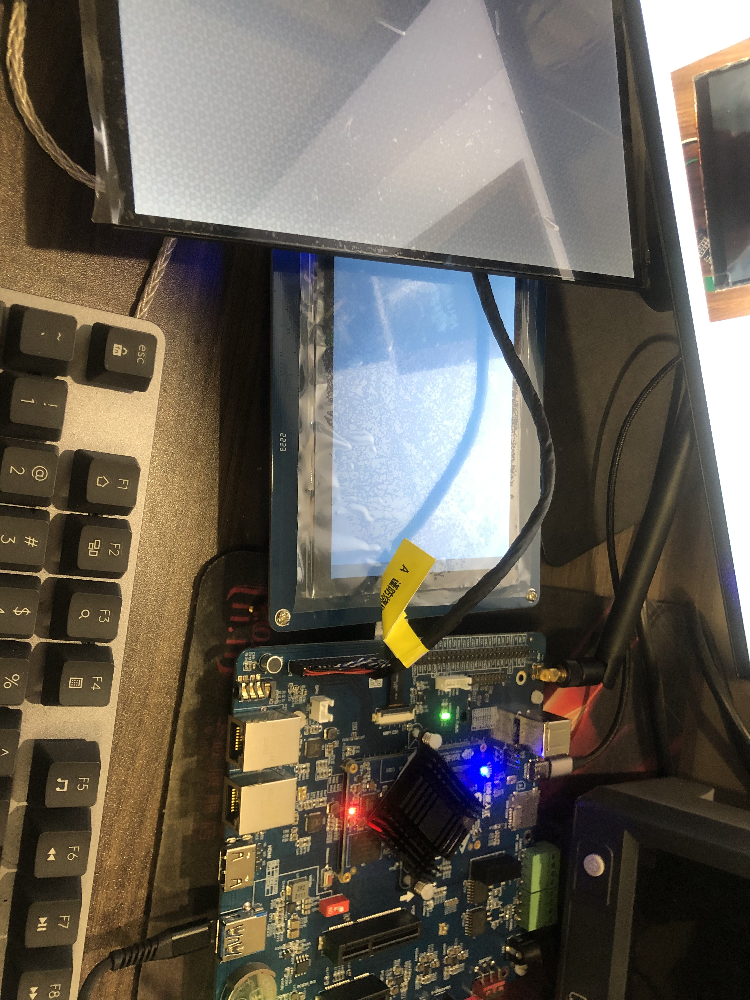

基于RK3568的LVGL图形框架平台

# 使用手册

| 版本号 |  生成日期  |  作者  | 修订内容 |
| :----: | :--------: | :----: | :------: |
|  v1.0  | 2022-12-26 | 肖劲涛 | 初始版本 |
|        |            |        |          |
|        |            |        |          |

## 1. 总体功能描述

&emsp;&emsp;我们要将LVGL图形GUI框架移植到近红外成像仪上，以实现设备控制和数据可视化的功能。近红外成像仪是一种用于工业领域的检测设备，可以通过非接触方式获取工业设备表面的图像和温度数据，从而实现设备的故障检测和预测维护。移植LVGL图形GUI框架可以为近红外成像仪提供一个友好的人机交互界面，使用户可以方便地控制设备和观察数据。此外，LVGL还可以提供丰富的图形控件和动画效果，帮助我们构建一个现代化、美观的界面设计，提高近红外成像仪的用户体验和操作效率。

## 2. 运行环境

### 硬件要求

|   类别   |   基本要求   |
| :------: | :----------: |
| 运行设备 | 近红外成像仪 |

### 软件要求

|    类别    |  基本要求   |
| :--------: | :---------: |
| Bootloader |   U-boot    |
|  内核版本  | Kernel 4.19 |
|  文件系统  |  Buildroot  |

## 3. 编译环境

1. 编译器：Buildroot-arm-linux-gnueabihf-gcc。
2. 编译环境：Ubuntu16.04。

## 4. 实验设备

## 5. 移植流程与说明

&emsp;移植LVGL图形用户界面框架到ARM平台（如RK3568）是一项具有挑战性的任务，需要按照以下步骤进行：

1. 硬件驱动适配： 首先需要为目标硬件平台编写相应的硬件驱动适配程序，使得LVGL可以与底层硬件进行交互。这可能涉及到LCD控制器、输入设备（如鼠标和触摸屏）、外部存储器和网络连接等硬件的适配。
2. 编译和移植LVGL框架：将LVGL框架源代码编译成ARM平台可执行程序，并将其移植到目标硬件平台上。
3. 应用程序开发：在ARM平台上开发应用程序，使用LVGL框架创建用户界面并实现所需的功能。

&emsp;&emsp;以下是一些需要重点关注的问题：

1. LCD驱动适配：将LCD屏幕驱动适配到LVGL框架上是移植中的一个关键步骤。需要熟悉LCD屏幕的工作原理和控制协议，并针对目标平台编写相应的驱动程序。
2. 输入设备适配：对于支持触摸屏或鼠标输入的应用程序，需要适配输入设备到LVGL框架上。这可能涉及到处理触摸屏或鼠标事件，并将其转换为LVGL事件。
3. 性能优化：在ARM平台上运行LVGL应用程序需要考虑性能问题。需要对内存和CPU占用进行优化，以确保应用程序能够在硬件平台上平稳运行。
4. 跨平台移植：如果需要将移植的应用程序部署到多个平台上，需要确保代码可以在不同的硬件和操作系统环境中正确运行。这可能需要进行不同的硬件适配和操作系统接口实现。

总之，在ARM平台上移植LVGL框架需要进行多个步骤，并且涉及到多个领域的知识。需要仔细考虑和测试每个步骤，并适当进行优化以确保应用程序的稳定性和性能。

### 5.1 硬件驱动适配

在进行硬件驱动适配时，需要针对不同的硬件设备编写相应的适配程序。对于涉及到LCD控制器的硬件，需要编写LCD控制器的适配程序，该程序需要将LVGL生成的图形数据通过LVGL提供的回调函数接口，发送给LCD控制器进行显示。如果涉及到触摸屏等输入设备，需要编写相应的输入设备适配程序，以便LVGL可以接收输入设备的输入信号，并进行相应的操作。

此外，还需要为外部存储器和网络连接等硬件编写相应的适配程序。对于外部存储器，需要编写相应的文件系统适配程序，以便LVGL可以在外部存储器中读写相关的配置文件和资源文件。对于网络连接，需要编写相应的网络适配程序，以便LVGL可以通过网络连接获取或上传相关数据。

在硬件适配的过程中，难点主要在于不同硬件平台的差异和特性。需要深入了解目标硬件平台的技术规格，同时对LVGL的工作原理和相关API接口有深入的了解。对于一些特殊的硬件设备，可能需要进行额外的调试和测试，以确保适配程序的正确性和稳定性。此外，由于硬件适配需要与底层硬件进行交互，需要一定的硬件调试和调优能力，这也是硬件适配过程中需要注意的问题。

### 5.2 编译和移植LVGL框架

&emsp;&emsp;在将LVGL框架移植到ARM平台上时，一个必要的步骤是编译源代码并生成可执行文件。这个过程包括两个主要的部分：编译LVGL框架源代码和生成可执行文件。以下将对这两个部分进行详细说明。

#### 5.2.1 编译LVGL框架源代码
&emsp;&emsp;在ARM平台上移植LVGL框架，需要首先下载LVGL的源代码。LVGL的源代码可以从官方网站上获取，也可以从GitHub上的官方代码库中获取。获取源代码后，需要针对ARM平台进行编译。LVGL框架支持多种编译器和构建工具，例如GCC和Make等。在ARM平台上，我们可以使用交叉编译工具链来编译LVGL的源代码。
交叉编译工具链是一种工具，可以在开发主机上编译适用于目标平台的程序。通常情况下，交叉编译工具链会包含一个用于目标平台的交叉编译器、库文件以及必要的头文件等。在ARM平台上，我们可以使用ARM GCC交叉编译工具链来编译LVGL的源代码。编译LVGL的源代码主要涉及以下几个步骤：

##### 1 配置编译环境
在开始编译之前，需要配置编译环境。具体来说，需要安装ARM GCC交叉编译工具链，并将其添加到系统的PATH环境变量中。同时，还需要安装相关的依赖库，如FreeType、PNG、JPEG等。这些依赖库可以通过包管理器安装，也可以手动从官方网站上下载并编译安装。

##### 2 配置LVGL的编译选项
LVGL支持多种配置选项，例如使用哪些驱动程序、是否启用抗锯齿、是否启用透明度等。在编译LVGL之前，需要配置好这些选项。可以通过修改lv_conf.h头文件来配置LVGL的编译选项。

##### 3 生成Makefile文件
Makefile是一个用于自动化编译的脚本文件，其中包含编译LVGL框架所需的命令和依赖关系等信息。在ARM平台上，可以使用autotools或CMake等工具来生成Makefile文件。

##### 4 执行编译命令
生成Makefile文件后，需要执行make命令来编译LVGL的源代码。编译过程会生成库文件和头文件等输出文件。

#### 5.2.2 生成可执行文件
&emsp;&emsp;将LVGL框架移植到ARM平台上后，需要将其打包成可执行文件。可执行文件通常包括一个主函数、所需的库文件以及其他必要的文件。生成可执行文件是编译LVGL源代码的一个重要步骤，主要涉及以下几个要点：

##### 1 选择交叉编译工具链
在编译LVGL源代码时，需要选择一个合适的交叉编译工具链，以便将源代码编译成目标平台可执行文件。通常，交叉编译工具链会包括C/C++编译器、链接器、头文件和库文件等。在选择工具链时，需要考虑目标硬件平台的处理器架构、操作系统和编译器等因素。

##### 2 配置编译选项
在使用交叉编译工具链编译LVGL源代码之前，需要根据目标硬件平台的具体情况配置编译选项。编译选项包括编译器的选项、链接器的选项、库文件的选项等。例如，可以通过编译选项指定LVGL的屏幕分辨率、字体库、颜色深度等参数，以便生成适用于目标硬件平台的可执行文件。

##### 3 编写Makefile文件
为了方便编译和管理LVGL源代码，可以使用Makefile文件来描述源代码的编译过程。Makefile文件包括源代码的依赖关系、编译选项、目标文件名等信息。通过Makefile文件，可以自动化执行编译和链接操作，生成目标平台的可执行文件。

##### 4 执行编译命令
在完成上述准备工作之后，就可以执行编译命令，将LVGL源代码编译成可执行文件。编译命令通常使用make命令，并指定Makefile文件的路径。make命令将根据Makefile文件中的信息自动执行编译和链接操作，生成可执行文件。在编译过程中，可以通过调试信息、错误提示等工具查找并解决编译错误。

##### 5 验证可执行文件
在生成可执行文件后，需要将其拷贝到目标硬件平台上，并在目标平台上验证其正确性。可以通过在目标平台上运行LVGL应用程序，观察应用程序的运行情况，确认LVGL框架已经成功移植到目标平台。在验证可执行文件时，还需要检查LVGL应用程序的性能、稳定性和兼容性等方面。

&emsp;&emsp;综上所述，生成可执行文件是编译LVGL源代码的一个重要步骤，需要选择合适的交叉编译工具链，配置编译选项，编写Makefile文件，执行编译命令，并在目标平台上验证可执行文件的正确性。在实际操作中，需要根据目标硬件平台的具体情况进行调整和优化。

### 5.3 应用程序开发

&emsp;&emsp;应用程序开发是将LVGL框架应用到具体的产品开发中的关键一步。在完成LVGL框架的移植之后，应用程序开发者可以基于LVGL框架创建用户界面并实现所需的功能。在开发过程中，开发者需要考虑以下几个方面：

1. 界面设计：应用程序开发者可以使用LVGL提供的UI控件、布局和主题等功能进行界面设计。这些UI控件包括按钮、文本框、进度条、滑块等。开发者可以根据产品需求自定义控件的样式和行为，并将它们放置在窗口中。通过使用布局和主题，可以轻松地创建一致的用户界面。
2. 应用逻辑：应用程序开发者需要实现应用程序的逻辑，包括处理用户输入、执行业务逻辑和更新界面等。开发者可以使用LVGL提供的事件处理机制来处理用户输入，例如点击按钮或者拖拽滑块。此外，开发者可以使用LVGL提供的动画和特效等功能来增强用户体验。
3. 数据存储：应用程序开发者需要考虑如何将数据存储到设备中。这可能涉及到使用外部存储器或者使用操作系统提供的文件系统。在实现数据存储时，应用程序开发者需要考虑数据的读取和写入速度以及数据的完整性和安全性等方面。
4. 网络连接：如果应用程序需要与网络进行交互，应用程序开发者需要实现相应的网络连接和通信机制。这可能涉及到使用网络协议栈、实现数据传输协议和处理网络中断等方面。
5. 性能优化：在开发过程中，应用程序开发者需要考虑如何提高应用程序的性能和响应速度。这可能涉及到减少CPU和内存的使用、优化算法和减少I/O操作等方面。

&emsp;&emsp;在应用程序开发过程中，LVGL提供了大量的API和示例代码，以帮助开发者更快速地创建用户界面和实现所需的功能。开发者可以通过LVGL官方文档和社区论坛等资源，获取更多的技术支持和帮助。