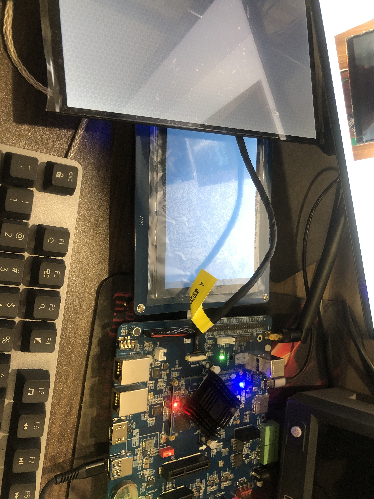
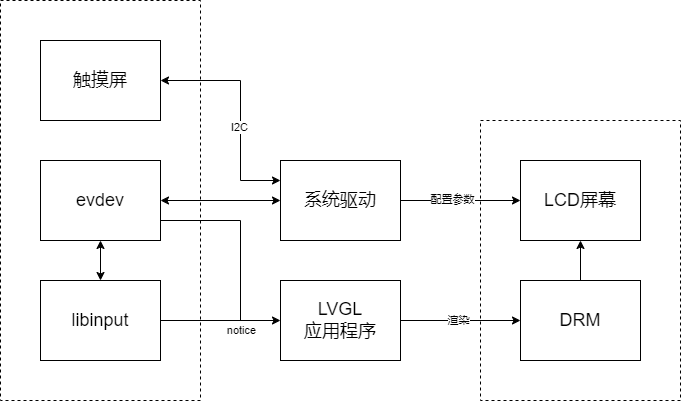
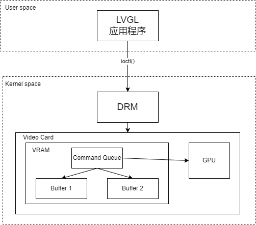
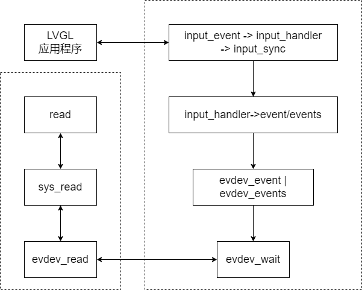
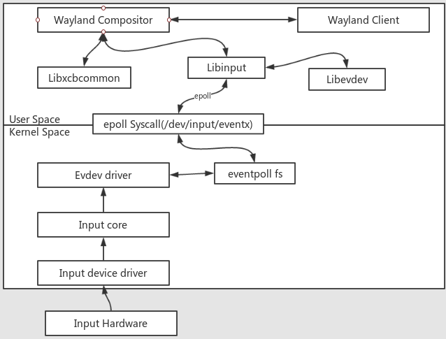
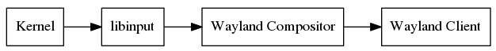

# 基于RK3568的LVGL图形与事件驱动软件

# 说明书

| 版本号 |  生成日期  |  作者  |  修订内容  |
| :----: | :--------: | :----: | :--------: |
|  v1.0  | 2022-12-30 | 肖劲涛 |  初始版本  |
|  v1.1  | 2024-01-24 | 肖劲涛 | 修订框架图 |
|        |            |        |            |

## 1. 总体功能描述

&emsp;&emsp;在RK3568平台上实现LVGL的各种驱动适配，需要针对不同类型的设备和驱动进行适配。主要的适配内容包括LCD屏幕驱动适配、DRM驱动适配、evdev驱动适配和libinput驱动适配等。

&emsp;&emsp;首先，为了将LVGL绘制的内容显示在液晶显示屏上，需要实现液晶显示屏驱动程序。液晶显示屏的接口和控制信号可能因制造商而异，因此驱动程序需要根据具体情况来编写。驱动程序应该实现液晶显示屏上像素的写入和读取，以及与LVGL库的交互。

&emsp;&emsp;其次，为了实现图形硬件加速，需要实现DRM驱动程序。DRM驱动程序用于管理显卡驱动程序、模式设置、内存管理等。对于RK3568平台上的LVGL，DRM驱动程序应该支持液晶显示屏的特定分辨率，并且应该与LVGL库的特定接口相匹配。DRM驱动程序可以实现更快速和更稳定的图形渲染，从而提高系统性能和响应速度。

&emsp;&emsp;另外，针对输入设备的驱动适配也是必要的。evdev驱动程序用于接收输入设备的事件，并将其发送给用户空间。在RK3568平台上，需要实现evdev驱动程序，以便将输入事件传递给LVGL库。驱动程序应该处理特定类型的输入设备，并将其转换为LVGL库所需的格式。类似地，libinput驱动程序也需要实现，以支持更高级的API和功能，包括手势和多点触摸支持。驱动程序应该处理特定类型的输入设备，并将其转换为LVGL库所需的格式。

&emsp;&emsp;液晶显示屏带有触摸功能，则还需要实现特定的触摸屏驱动程序。驱动程序应该识别触摸屏事件，并将其转换为LVGL库所需的格式。此外，需要与外部设备进行通信，则可能需要实现GPIO（通用输入/输出）驱动程序。GPIO驱动程序可以访问处理器的GPIO端口，并控制其输出和输入，从而实现与外部设备的通信。

&emsp;&emsp;总之，在RK3568平台上实现LVGL的各种驱动适配需要根据具体情况来实现相应的驱动程序。通过适配不同类型的设备和驱动程序，可以实现更高效、更稳定的系统，提高用户的交互体验。

## 2. 运行环境

### 硬件要求

|   类别   |   基本要求   |
| :------: | :----------: |
| 运行设备 | 近红外成像仪 |

### 软件要求

|    类别    |  基本要求   |
| :--------: | :---------: |
| Bootloader |   U-boot    |
|  内核版本  | Kernel 4.19 |
|  文件系统  |  Buildroot  |

## 3. 编译环境

1. 编译器：Buildroot-arm-linux-gnueabihf-gcc。
2. 编译环境：Ubuntu16.04。

## 4. 实验设备

<strong>图1：实验设备</strong>

## 5. 移植流程与说明

&emsp;&emsp;下面是关于在RK3568平台上实现LVGL的各种驱动适配：

1. 在RK3568平台上，可以使用驱动程序来控制液晶显示屏幕。对于LVGL，您需要实现特定的驱动程序来将LVGL绘制的内容显示在液晶显示屏上。液晶显示屏的接口和控制信号可能因制造商而异，因此驱动程序需要根据具体情况来编写。驱动程序应该实现液晶显示屏上像素的写入和读取，以及与LVGL库的交互。
2. DRM（Direct Rendering Manager）驱动程序用于管理Linux系统中的图形硬件加速。它可以管理显卡驱动程序、模式设置、内存管理等。对于RK3568平台上的LVGL，您需要实现DRM驱动程序，以便将LVGL绘制的内容渲染到屏幕上。DRM驱动程序应该支持液晶显示屏的特定分辨率，并且应该与LVGL库的特定接口相匹配。
3. evdev驱动程序用于接收输入设备（如键盘、鼠标、触摸屏等）的事件，并将其发送给用户空间。在RK3568平台上，您需要实现evdev驱动程序，以便将输入事件传递给LVGL库。驱动程序应该处理特定类型的输入设备，并将其转换为LVGL库所需的格式。
4. 类似于evdev驱动程序，libinput驱动程序用于接收输入设备的事件。不同的是，libinput驱动程序提供了更高级的API和功能，以便更容易地处理多个输入设备，并提供手势和多点触摸支持。在RK3568平台上，您需要实现libinput驱动程序，以便将输入事件传递给LVGL库。驱动程序应该处理特定类型的输入设备，并将其转换为LVGL库所需的格式。
5. RK3568平台上使用的液晶显示屏带有触摸功能，则需要实现特定的触摸屏驱动程序。驱动程序应该识别触摸屏事件，并将其转换为LVGL库所需的格式。
6. RK3568平台上使用的设备需要与外部设备进行通信，可能需要实现GPIO（通用输入/输出），以控制其他设备模块。

<strong>图2：LVGL应用适配驱动框架</strong>

### 5.1 LCD屏幕驱动适配

&emsp;&emsp;在RK3568平台上使用驱动程序来控制液晶显示屏是非常重要的，因为这是将LVGL库中的内容绘制在屏幕上的必要步骤。具体而言，液晶显示屏的驱动程序需要实现以下功能：

1. 像素写入和读取：液晶显示屏由许多像素组成，驱动程序需要实现像素写入和读取功能，以便将LVGL库中的内容绘制在屏幕上并从屏幕上读取像素数据。
2. 与LVGL库的交互：液晶显示屏驱动程序需要与LVGL库交互，以将LVGL库中的内容绘制在屏幕上。此外，驱动程序还需要从LVGL库中读取绘制的内容，以便在液晶显示屏上显示。
3. 根据具体情况编写：液晶显示屏的接口和控制信号因制造商而异，因此液晶显示屏驱动程序需要根据具体情况来编写，以实现正确的驱动程序。

&emsp;&emsp;液晶显示屏驱动程序的实现需要考虑多个因素，包括液晶显示屏的硬件规格、接口协议、屏幕分辨率等等。通过编写合适的驱动程序，可以将LVGL库中的内容显示在屏幕上，从而实现各种UI效果和交互。同时，还可以进一步优化系统的性能和稳定性，提高用户的使用体验。

### 5.2 DRM驱动适配

&emsp;&emsp;DRM（Direct Rendering Manager）驱动程序在Linux系统中扮演着至关重要的角色，它可以管理图形硬件加速，包括显卡驱动程序、模式设置和内存管理等。在RK3568平台上使用DRM驱动程序可以极大地优化系统性能和稳定性，并提高用户的使用体验。对于LVGL库，DRM驱动程序的实现需要考虑以下几个方面：

1. 支持特定分辨率：DRM驱动程序应该支持液晶显示屏的特定分辨率，以便正确地显示LVGL库中的UI效果和交互。
2. 与LVGL库的接口匹配：DRM驱动程序需要与LVGL库的特定接口相匹配，以便将LVGL库中的内容渲染到屏幕上。这需要涉及到各种图形渲染和加速技术，例如OpenGL、Vulkan和GPU硬件加速等。
3. 硬件适配：DRM驱动程序需要适配具体的硬件平台，包括显卡驱动程序、内存管理等。这需要了解RK3568平台的硬件规格和特性，以便正确实现DRM驱动程序。

&emsp;&emsp;通过正确实现DRM驱动程序，可以极大地优化LVGL库的图形渲染效果，提高系统的性能和稳定性，并提供更好的用户体验。此外，DRM驱动程序还可以支持多个显示屏幕，多窗口管理等高级图形特性，使系统更加灵活和强大。

<strong>图3：DRM驱动框架</strong>

### 5.3 evdev驱动适配

&emsp;&emsp;evdev驱动程序在Linux系统中起到重要作用，它可以接收输入设备（如键盘、鼠标、触摸屏等）的事件，并将其传递到用户空间。在RK3568平台上，实现evdev驱动程序可以使LVGL库更好地处理输入事件，提高用户交互体验。对于RK3568平台上的LVGL库，evdev驱动程序的实现需要考虑以下几个方面：

1. 处理特定类型的输入设备：RK3568平台支持各种输入设备，包括键盘、鼠标和触摸屏等。evdev驱动程序应该处理特定类型的输入设备，并将其转换为LVGL库所需的格式。
2. 转换为LVGL库所需的格式：LVGL库需要特定的输入格式来处理输入事件，例如键盘按键、鼠标单击、触摸屏手势等。evdev驱动程序应该将接收到的输入事件转换为LVGL库所需的格式，并将其传递给LVGL库。
3. 处理多点触摸：对于支持多点触摸的输入设备，evdev驱动程序需要处理多个触点的输入事件，并将其转换为LVGL库所需的格式。这需要考虑到多点触控的算法和数据结构，以便正确地解析和处理多点触控事件。

&emsp;&emsp;通过正确实现evdev驱动程序，可以极大地提高RK3568平台上LVGL库的输入事件处理能力，从而提高用户交互体验。此外，evdev驱动程序还可以支持输入设备的配置和管理，例如灵敏度、滚动速度、按钮映射等，使系统更加灵活和易用。

<strong>图4：evdev驱动框架</strong>

### 5.4 libinput驱动适配

&emsp;&emsp;libinput驱动程序是一种更高级的输入设备驱动程序，提供了比evdev驱动程序更丰富的API和功能。它能够更容易地处理多个输入设备，并提供手势和多点触摸支持。在RK3568平台上，实现libinput驱动程序可以使LVGL库更易于使用，并提供更好的用户体验。

&emsp;&emsp;在实现libinput驱动程序时，需要考虑平台上所支持的输入设备类型和特性。例如，如果涉及到触摸屏，需要支持多点触摸，并根据输入设备的事件生成LVGL库所需的事件。此外，驱动程序还需要支持常见的手势，例如双指缩放和滑动等，以便在LVGL库中进行处理。

&emsp;&emsp;与evdev驱动程序相比，libinput驱动程序提供了更丰富的事件信息和手势识别功能，这对于实现用户友好的交互体验非常重要。在实现libinput驱动程序时，还需要考虑性能问题，例如如何处理高速的输入事件以避免延迟。

&emsp;&emsp;总之，实现libinput驱动程序可以为RK3568平台上的LVGL库提供更好的用户交互体验和更高级的功能，因此是一个非常重要的任务。在实现驱动程序时，需要考虑平台所支持的输入设备类型和特性，并提供适当的手势和事件处理功能，以便实现最佳的用户体验。

<strong>图5：wayland_input驱动框架</strong>

<strong>图6：wayland驱动框架</strong>

### 5.5 触摸屏驱动适配

&emsp;&emsp;对于RK3568平台上带有触摸功能的液晶显示屏，需要实现特定的触摸屏驱动程序，以便将触摸事件传递给LVGL库。触摸屏驱动程序应该识别触摸事件，包括接触、移动和释放事件，并将其转换为LVGL库所需的格式。

&emsp;&emsp;触摸屏驱动程序通常使用一个特定的内核模块来与Linux系统进行交互。这个内核模块通过触摸屏控制器读取触摸屏的坐标，并将触摸事件发送给输入子系统。驱动程序应该处理特定类型的触摸屏，根据触摸屏的厂商和型号来设置特定的参数和接口。

&emsp;&emsp;一些触摸屏可能支持多点触摸或手势识别。在这种情况下，驱动程序应该能够识别多个触点，并将它们转换为LVGL库所需的格式。对于支持手势识别的触摸屏，驱动程序应该能够识别特定的手势，并将它们转换为LVGL库所需的格式。例如，在触摸屏上进行上下滑动手势可以转换为LVGL库中的滚动事件。

&emsp;&emsp;触摸屏驱动程序的实现需要与LVGL库的特定接口相匹配，以便将触摸事件正确地传递给LVGL库。驱动程序应该将触摸事件转换为LVGL库所需的格式，例如坐标、触摸类型、触摸状态等，并将其发送给LVGL库进行处理。

### 5.6 GPIO驱动适配

&emsp;&emsp;在RK3568平台上，为了实现与外部设备的通信，可能需要使用GPIO（通用输入/输出）驱动程序。GPIO是一种通用的接口标准，可用于控制数字输入/输出线，以便控制外部设备的状态。这些数字输入/输出线可以直接控制单个引脚，也可以控制整个端口，从而控制多个引脚。

&emsp;&emsp;要实现GPIO驱动程序，需要了解所选GPIO控制器的特定寄存器和内存映射。通过配置这些寄存器和内存映射，可以控制GPIO的输入和输出状态。通常，需要为GPIO分配相应的中断和回调函数，以便在输入或输出状态发生变化时，通知相关的模块。

&emsp;&emsp;与其他驱动程序一样，GPIO驱动程序应该提供特定的接口，以便与LVGL库进行交互。这些接口应该允许LVGL库读取和设置GPIO引脚的状态，以及注册中断回调函数，以便在输入或输出状态发生变化时，通知LVGL库。

&emsp;&emsp;需要注意的是，GPIO的具体实现可能会因设备的不同而有所不同。因此，在实现GPIO驱动程序时，需要考虑到使用的设备的具体要求，并根据情况对代码进行适当的修改。