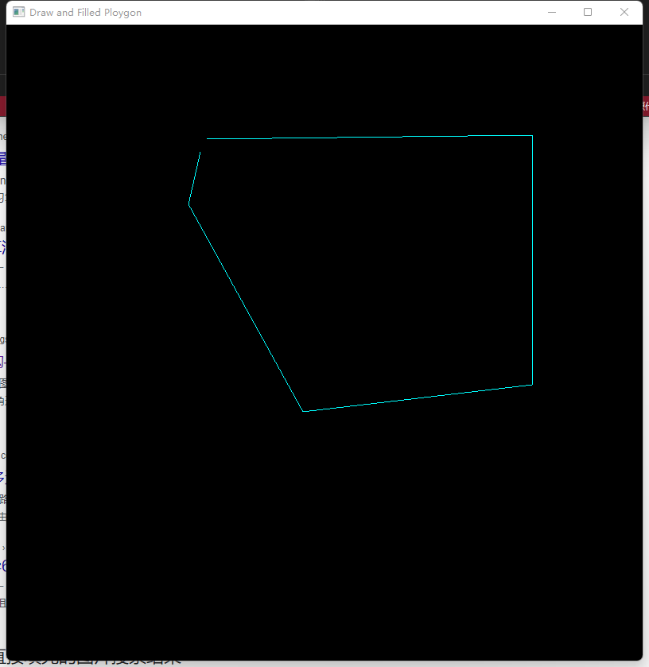
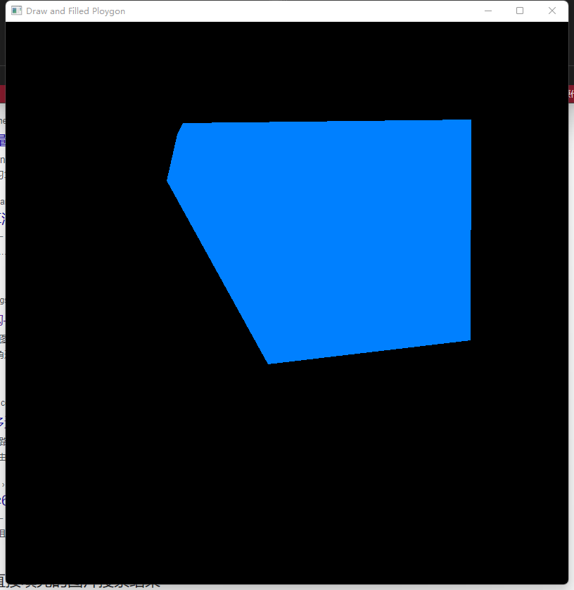
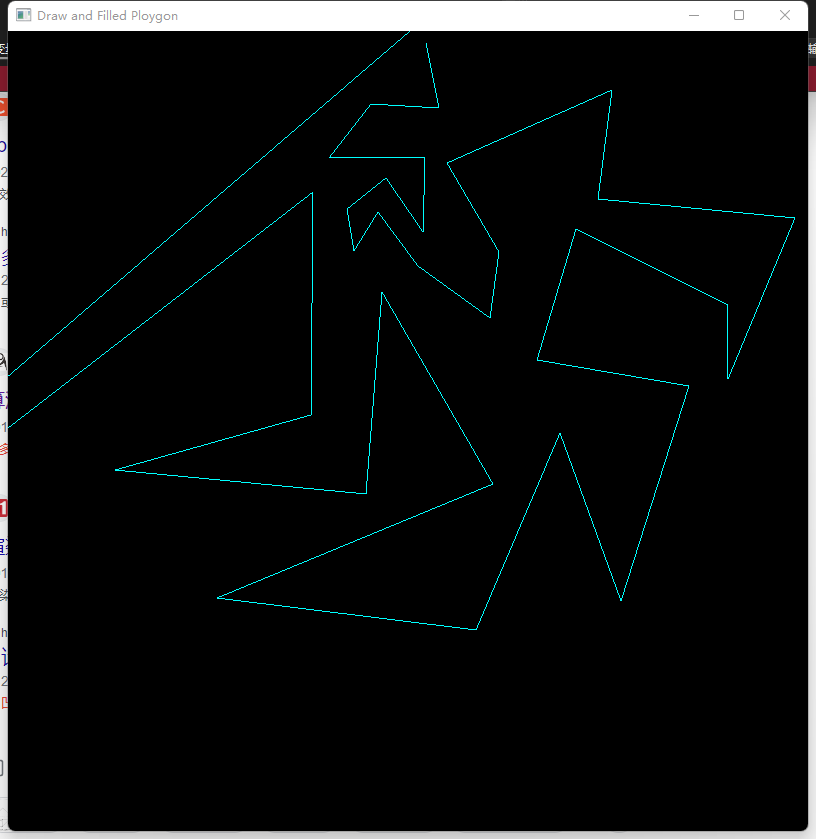
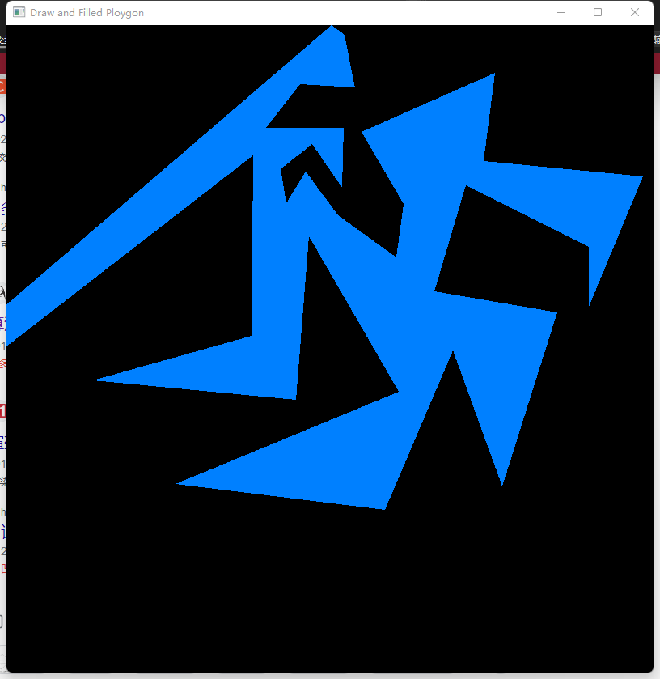

# 基于多边形三角分割法的近红外成像多边形填充软件

# 使用手册

| 版本号 |  生成日期  |  作者  | 修订内容 |
| :----: | :--------: | :----: | :------: |
|  v1.0  | 2022-12-30 | 肖劲涛 | 初始版本 |
|        |            |        |          |
|        |            |        |          |

## 1. 总体功能描述

&emsp;&emsp;近红外成像仪是一种能够在不接触物体的情况下获取其温度分布的设备。在工业领域，它被广泛用于温度测量、工业设备检测、电力系统等领域。在这些应用中，经常需要对多边形区域进行温度分布的填充，以便更好地分析和理解温度分布情况。多边形填充软件可以用于对这些多边形区域进行温度分布的填充。该软件可以将多边形分解为一组不相交的三角形，并对每个三角形进行温度计算和填充。通过这种方式，可以更加准确地理解温度分布情况，进而进行工业设备检测和故障分析。

&emsp;&emsp;在电力系统中，我们需要对电力传感器周围的多边形区域进行温度分布的填充，以便更好地理解电力传感器的温度分布情况。我们可以使用多边形填充软件，将该多边形区域分解为一组不相交的三角形，并对每个三角形进行温度计算和填充。通过这种方式，我们可以更加准确地了解电力传感器周围的温度分布情况，从而更好地分析电力系统的运行情况。在工业设备检测中，多边形填充软件也可以用于对设备表面的多边形区域进行温度分布的填充。通过这种方式，可以更加准确地理解设备表面的温度分布情况，并及时发现设备运行过程中出现的问题，从而减少生产事故的发生。

&emsp;&emsp;用于近红外成像仪的多边形填充软件旨在实现对多边形区域的温度分布填充，以便更好地理解温度分布情况，进而进行工业设备检测和故障分析。该软件基于将多边形分解为一组不相交的三角形，并对每个三角形进行温度计算和填充的方法。在温度分布填充的过程中，可以利用近红外成像仪获得的温度数据，对每个三角形进行温度计算，并根据计算结果进行填充。通过这种方式，可以更加准确地了解温度分布情况，从而进行更为有效的工业设备检测和故障分析。

## 2. 运行环境

### 硬件要求

|   类别   |   基本要求   |
| :------: | :----------: |
| 移植设备 | 近红外成像仪 |
| 测试设备 | 个人电脑 |

### 软件要求

|    类别    |  基本要求   |
| :--------: | :---------: |
|  目标系统 | Kernel 4.19 |
| 测试系统 | Windows 10 |

## 3. 编译环境

1. 目标编译器：Buildroot-arm-linux-gnueabihf-gcc。
2. 目标编译环境：Ubuntu16.04。
3. 测试编译器：MSVC 14.31
4. 测试编译环境：Windows 10

## 4. 软件测试效果

图1：凸多边形

图2：凸多边形填充效果

图3：凹多边形

图4：凹多边形填充效果

## 5. 软件具体描述

&emsp;&emsp;将多边形分割为多个三角形的方法是一种常见的多边形填充软件。其主要实现流程如下：

1. 首先，通过选择一个多边形内的点来确定一个三角形。这个点可以是多边形的中心点，或者是距离多边形边缘最远的点。
2. 接着，选择一个多边形的边，并且与该边相邻的三角形中，找到一个点可以与当前三角形共同构成一个新的三角形。
3. 如果找到这样的点，则将该点和边的两个端点构成一个新的三角形，并将这个三角形加入到三角形列表中。
4. 如果没有找到可以与当前三角形共同构成一个新三角形的点，则选择另一个边，并重复步骤2和3。
5. 重复步骤2到4，直到所有可以与当前三角形构成新三角形的点都已经处理完毕。
6. 当所有的点都已被处理，且所有新的三角形都已经加入到三角形列表中后，多边形就被分割为多个三角形了。
7. 最后，可以通过遍历每个三角形，并计算其温度值，来实现多边形的温度填充。

&emsp;&emsp;需要注意的是，在实际的软件实现中，可能需要对一些特殊情况进行特殊处理，例如处理多边形内部有孔洞的情况。此外，在计算温度值时，还需要考虑温度分布的实际情况，并结合近红外成像仪的特性进行合理的处理。

&emsp;&emsp;在该软件中，首先需要选择一个多边形内的点来确定一个三角形。选择的点需要满足两个条件：一是在多边形内部，二是可以作为多边形分割的起点。常见的选择方式包括以下两种：

1. 多边形的中心点：计算多边形所有顶点的坐标，求其平均值得到多边形的中心点。中心点在多边形内部，且与多边形的各边距离相等，可以作为分割的起点。
2. 距离多边形边缘最远的点：计算多边形的边缘，选取离边缘最远的点作为起点。可以采用迭代方法，逐步扩大搜索范围，直到找到距离最远的点。

&emsp;&emsp;选择起点后，需要对多边形进行三角剖分。一种简单的实现方法是从起点开始，向多边形的顶点或边缘逐步延伸，选择与之相邻的两个顶点或边缘，构成一个新的三角形。具体的流程可以描述如下：

1. 选择一个多边形内的点作为起点，并将其加入三角形集合中。
2. 找到起点相邻的两个点或边缘，构成一个新的三角形，并将其加入三角形集合中。
3. 分别对新生成的两个三角形重复执行步骤2，直到所有的三角形都被分割完毕。

&emsp;&emsp;需要注意的是，在分割过程中需要保证新生成的三角形不与原多边形重叠，并且新生成的三角形不包含多边形外部的点。对于不规则的多边形，可能需要进行特殊处理，以确保分割的正确性和完整性。

