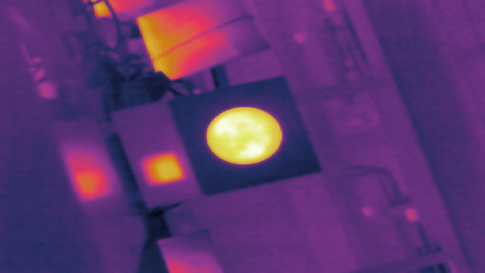
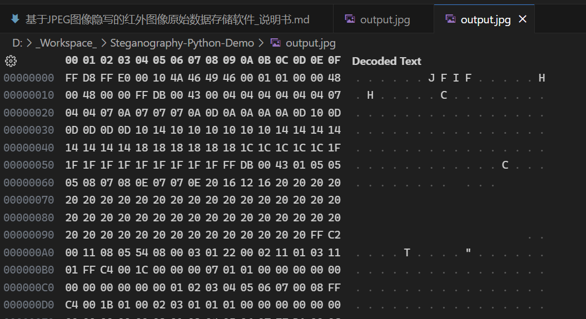
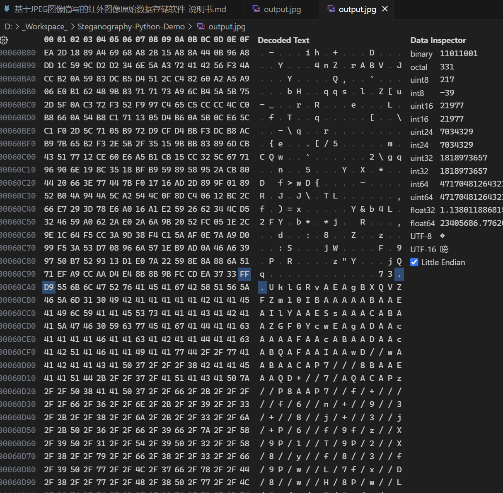
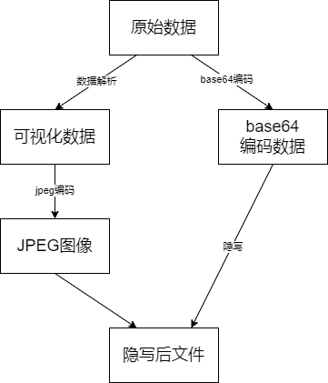
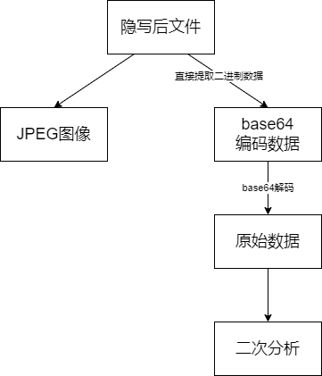

# 基于JPEG图像隐写的红外图像原始数据存储软件

# 使用手册

| 版本号 |  生成日期  |  作者  | 修订内容 |
| :----: | :--------: | :----: | :------: |
|  v1.0  | 2024-01-24 | 肖劲涛 | 初始版本 |
|        |            |        |          |
|        |            |        |          |1qaz 

## 1. 总体功能描述

&emsp;&emsp;随着红外技术在工业领域的广泛应用，对红外图像的获取和处理需求日益增长。本软件旨在满足工业领域对红外图像原始数据的高效存储和可视化需求，通过创新性地结合JPEG图像隐写技术，实现了红外图像原始数据的安全存储和可靠解析。

&emsp;&emsp;在工业检测、医学成像等领域，红外技术被广泛应用于无损检测、热成像等方面。然而，红外图像原始数据的存储一直是一个具有挑战性的问题。传统的存储方式往往采用无损格式，但文件体积庞大，不利于存储和传输。同时，使用JPEG格式进行存储虽然能够减小文件大小，但由于JPEG的压缩算法，可能导致红外图像的原始数据丢失，影响后续分析和应用。

&emsp;&emsp;为解决这一问题，本软件提出了一种创新性的方案：将红外原始数据可视化后存储在JPEG图像中，并利用JPEG图像隐写技术嵌入原始数据。这样一来，既保留了JPEG图像的压缩优势，又确保了红外图像原始数据的完整性。用户可以随时使用本软件对嵌入的数据进行重新解析，实现对原始数据的有效提取和利用。

本软件具有如下特点：

1. 红外图像可视化存储： 本软件允许用户将红外原始数据通过可视化的方式存储在JPEG图像中，便于直观观察和管理。
2. JPEG图像隐写技术： 利用先进的JPEG图像隐写技术，将红外图像原始数据嵌入JPEG图像中，实现高效而安全的数据存储。
3. 数据完整性保障： 通过本软件存储的红外图像不仅保持了较小的文件大小，还避免了因JPEG压缩而引起的数据损坏，确保了原始数据的完整性。
4. 可逆解析： 用户可以随时使用本软件对存储在JPEG图像中的原始数据进行可逆解析，方便后续数据分析和应用。
5. 广泛适用性： 适用于各种需要红外图像数据存储的场景，包括工业领域的无损检测、医学领域的热成像等应用场景。

&emsp;&emsp;通过这些功能特点，本软件不仅提高了红外图像原始数据的存储效率，还确保了数据的安全性和可靠性，为工业和科研领域的红外图像处理提供了一种创新的解决方案。

## 2. 运行环境

### 硬件要求

|   类别   |   基本要求   |
| :------: | :----------: |
| 移植设备 | 近红外成像仪 |
| 测试设备 | 个人电脑 |

### 软件要求

|    类别    |  基本要求   |
| :--------: | :---------: |
|  目标系统 | Kernel 4.19 |
| 测试系统 | Windows 11 |

## 3. 编译环境

1. 目标编译器：Buildroot-arm-linux-gnueabihf-gcc。
2. 目标编译环境：Ubuntu16.04。
3. 测试编译器：MSVC 14.31
4. 测试编译环境：Windows 11

## 4. 软件测试效果

<strong>图1：红外图像展示</strong>

<strong>图2：Jpeg图像数据头部</strong>

<strong>图3：Jpeg图像数据尾部附加原始数据</strong>

## 5. 软件具体描述

&emsp;&emsp;使用图像隐写技术来为图片添加额外的数据的基本流程如下：

1. 找到JPEG的`EOI`标识符，二进制为`0xFF 0xD9`。
2. 使用base64编码我们需要隐写的数据，避免我们想要追加我数据中出现`0xFF`一类的Jpeg标识符。

&emsp;&emsp;对于解码，则是按照如下步骤实现：

1. 找到JPEG的`EOI`标识符，二进制为`0xFF 0xD9`。
2. 将`EOI`标识符之后的数据使用base64解码即可。

<strong>图4：编码流程</strong>

<strong>图5：解码流程</strong>
